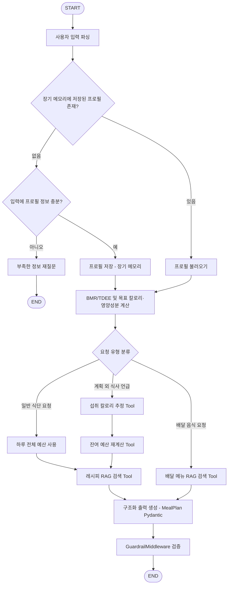

# GoodDining
> 목표 기반 식단 추천 에이전트 (레시피 포함)

## 1. 서비스 소개 및 사용 시나리오

### 1.1 문제 정의

다이어트, 체중 유지, 근육 증가 등 목표가 있는 사용자는 PT를 받거나, 따로 공부를 한 것이 아니라면, 사용자는 매번 자신의 기초대사량(BMR)과 활동대사량(TDEE)를 계산하고, 목표에 맞는 칼로리·영양성분을 산출한 뒤, 그에 맞춰 식단을 맞추거나 레시피를 찾아야 한다. 이 과정은 오래해온 사람이나, 규칙적으로 습관화하지 않았다면, 번거롭고 귀찮은 일에 해당한다. 심지어 친구들과의 약속이나 회식 등으로 식단이 망가졌을 때 나머지 끼니를 어떻게 조절해야 할지 판단하기도 어렵다. 또한 매번 직접 요리를 하기보다 배달 음식을 먹고 싶을 때, 어떤 메뉴가 오늘 남은 칼로리·영양성분 목표에 맞는지 판단하기도 쉽지 않다.

### 1.2 서비스 개요

GoodDining Agent는 사용자의 신체 정보와 목표(감량/유지/근육 증가)를 입력받아 다음을 자동으로 수행하는 대화형 AI 에이전트입니다.

- 기초대사량(BMR)과 활동대사량(TDEE)을 계산하고, 목표에 맞는 하루 칼로리·영양성분 목표를 산출
- 단발성 레시피 하나가 아니라, 아침·점심·저녁으로 구성된 하루 전체 **식단**을 추천하고, 식단에 포함된 각 요리의 **레시피**도 함께 제공
- 대화 맥락을 기억하여 "다른 메뉴로 바꿔줘", "오늘 저녁만 다시 추천해줘" 같은 멀티턴 요청을 처리
- 회식이나 약속 등으로 계획에 없던 식사를 했을 때, 사용자가 먹은 음식을 알려주면 잔여 칼로리·영양성분 예산을 재계산해 남은 끼니 구성을 다시 추천
- 배달 음식이 먹고 싶을 때, 원하는 브랜드/메뉴(예: 버거킹 햄버거)를 말하면 해당 프랜차이즈의 메뉴별 영양정보를 검색해 오늘 남은 예산에 맞는 메뉴를 추천
- 세션이 종료되어도 신체 정보, 목표, 알러지·선호 등을 장기 기억하여, 다음에 다시 찾아왔을 때 재입력 없이 이어서 추천

### 1.3 사용 시나리오 예시

```
사용자: 나 27살 남자, 키 175cm, 몸무게 78kg이고 활동량은 보통이야. 살 좀 빼고 싶어.
Agent : (BMR/TDEE 계산, 프로필 장기 저장) 하루 목표 칼로리는 약 2,050kcal, 단백질 155g / 탄수화물 180g / 지방 55g 정도로 설정하는 게 좋겠어요. 이에 맞는 아침·점심·저녁 식단을 추천해드릴게요.
...(하루 식단 + 각 요리 레시피 추천)...

사용자: 점심에 다른 메뉴로 바꿔줘
Agent : (직전 대화 맥락 유지) 점심 메뉴를 대체할 다른 요리로 바꿔드릴게요.
...

사용자: 오늘 저녁에 친구랑 삼겹살에 소주 한 병 먹었어. 나머지는 어떻게 먹어야 할까?
Agent : (섭취 칼로리 추정 → 잔여 예산 재계산) 삼겹살+소주로 대략 1,400kcal를 드신 것 같아요. 오늘 남은 예산은 650kcal 정도예요. 무리하게 굶기보다는 가벼운 저칼로리 메뉴로 조절하는 걸 추천해요.
...(저칼로리 메뉴 추천)...

사용자: 저녁은 배달로 버거킹 먹고 싶어
Agent : (배달 메뉴 RAG 검색 → 잔여 예산 대조) 오늘 남은 예산은 700kcal, 단백질 40g 정도예요. 버거킹 메뉴 중에서는 와퍼 주니어 단품(약 450kcal) 정도가 잘 맞아요. 콜라 대신 제로콜라를 곁들이면 예산 안에서 즐기실 수 있어요.

(다음 날, 새 세션)
사용자: 오늘 식단 추천해줘
Agent : (장기 메모리에서 프로필 불러오기) 이전에 알려주신 목표(감량)와 신체 정보를 기억하고 있어요. 오늘도 같은 기준으로 식단을 추천해드릴게요.
...
```

---

## 2. 전체 아키텍처

### 2.1 구성 요소 요약

| 구성 요소 | 내용 |
|---|---|
| Agent Core | `langchain.agents.create_agent` (내부적으로 LangGraph StateGraph 기반 실행) |
| Tool (6개) | BMR/TDEE 계산, 칼로리·영양성분 목표 산출, 섭취 칼로리 추정, 잔여 예산 계산, 레시피 검색(RAG retriever), 배달 프랜차이즈 메뉴 검색(RAG retriever) |
| RAG | (1) 레시피 데이터셋, (2) 배달 프랜차이즈 메뉴 영양정보 데이터셋 → 임베딩 → `InMemoryVectorStore` → 유사도 검색 |
| Memory | 단기: `MemorySaver` checkpointer(세션 내 멀티턴) / 장기: `Store` 기반 사용자 프로필·선호·알러지 영구 저장(세션 간 유지) |
| Middleware | GuardrailMiddleware(무리한 절식/극단적 목표 차단), LoggingMiddleware(요청·응답 로깅) |
| OutputParser | Pydantic 기반 구조화 출력 (`UserProfile`, `MealPlan`) |

### 2.2 실행 흐름 (Workflow Diagram)



> 실제 구현 시 `graph.get_graph().draw_mermaid()`로 생성한 다이어그램으로 교체 권장합니다.

### 2.3 조건부 분기(Conditional Edge) 설명

1. **프로필 조회/완결성 분기**: 장기 메모리에 저장된 프로필이 있으면 바로 불러오고, 없으면서 입력 정보도 부족하면 재질문 경로로, 충분하면 계산 후 저장 경로로 진행
2. **요청 유형 분기**: 대화 내용을 기준으로 (a) 계획 외 식사를 이미 먹었다고 언급한 경우 → 잔여 예산 재계산 경로, (b) 배달 음식을 원하는 경우 → 배달 메뉴 RAG 검색 경로, (c) 그 외 일반 식단 요청 → 하루 전체 예산 기준 추천 경로로 분기

---

## 3. 사용된 Tool / RAG / Memory / Middleware 상세

### 3.1 Tool

| Tool | 설명 |
|---|---|
| `calculate_bmr_tdee` | Mifflin-St Jeor 공식으로 BMR 계산 후 활동계수를 곱해 TDEE 산출 |
| `calculate_calorie_target` | 목표(감량/유지/증량)에 따라 TDEE에서 칼로리 조정 및 영양성분(단백질/탄수화물/지방) 비율 산출 |
| `estimate_meal_nutrition` | 사용자가 설명한 음식(예: "삼겹살 2인분, 소주 한 병")의 대략적인 칼로리·영양성분을 추정 (LLM 추정치이며 정밀 수치 아님을 명시) |
| `calc_remaining_budget` | 하루 목표에서 이미 섭취한 양을 제외하고 남은 끼니 수에 맞게 잔여 예산을 재분배 |
| `search_recipes` | 레시피 벡터스토어에 대한 retriever를 Tool로 래핑, 목표 칼로리·영양성분 범위에 맞는 요리를 검색해 식단으로 조합 |
| `search_delivery_menu` | 배달 프랜차이즈 메뉴 영양정보 벡터스토어를 검색하는 retriever Tool. 브랜드명·메뉴명과 잔여 예산을 함께 반영해 조건에 맞는 메뉴를 추천 |

### 3.2 RAG

**(1) 레시피 데이터셋**
- **데이터**: 레시피 20~30개(메뉴명, 재료, 조리법, 칼로리, 단백질/탄수화물/지방, 태그[저칼로리/고단백 등])를 문서화
- **파이프라인**: 텍스트 분할 → 임베딩(OpenAIEmbeddings 등) → `InMemoryVectorStore` 인덱싱 → `as_retriever()`로 유사도 검색
- **활용 방식**: 목표 칼로리·영양성분 범위와 사용자 선호(알러지/비선호 재료)를 쿼리에 반영하여 관련 요리를 검색 후 하루 식단으로 조합

**(2) 배달 프랜차이즈 메뉴 데이터셋**
- **데이터**: 버거킹(162개) + 서브웨이(65개), 총 227개 메뉴를 공식 영양성분표 기준으로 문서화. 항목당 브랜드/카테고리/메뉴명/중량/칼로리/단백질/당류/포화지방을 기록(세트 메뉴는 사이드·음료 조합에 따라 칼로리가 달라져 `calories_min`~`calories_max` 범위로만 기록)
- **파이프라인**: 레시피 데이터셋과 동일하게 임베딩 후 별도 `InMemoryVectorStore`에 인덱싱, `brand`로 필터링 가능
- **활용 방식**: 사용자가 원하는 브랜드/메뉴를 말하면 해당 프랜차이즈 메뉴 중 잔여 예산에 맞는 항목을 검색해 추천
- **참고**: 원본 자료에 탄수화물·총지방 수치가 없어 이 두 값은 데이터셋에 포함하지 않았습니다(포화지방만 존재). 레시피 데이터셋과 달리 매크로 전체를 대조하기보다 칼로리·단백질 위주로 매칭합니다.

### 3.3 Memory (단기 + 장기)

- **단기 메모리**: `langgraph.checkpoint.memory.MemorySaver`를 checkpointer로 연결, `thread_id`로 세션 내 대화(직전 추천 메뉴, 방금 언급한 식사 등)를 기억하여 멀티턴 대화 처리
- **장기 메모리**: `Store`(예: SQLite 기반 저장소)를 통해 사용자 프로필(성별/나이/키/몸무게/활동량/목표), 알러지·비선호 재료를 `user_id` 기준으로 영구 저장. 세션이 종료되거나 새로운 대화를 시작해도 이전에 입력한 정보를 다시 불러와 재입력 없이 이어서 추천 가능
- 실행 흐름상 대화 시작 시 장기 메모리 조회 → 프로필 존재 여부에 따라 재질문 여부를 분기하는 방식으로 단기/장기 메모리를 함께 활용

### 3.4 Middleware

| Middleware | 역할 |
|---|---|
| `GuardrailMiddleware` | 잔여 예산이 부족한 경우에도 끼니를 거르라는 답변을 하지 않도록 응답을 검증·수정하고, 지나치게 낮은 칼로리 목표(예: 일일 1,200kcal 미만) 설정 시 경고 문구를 추가 |
| `LoggingMiddleware` | 모델 호출/Tool 호출 전후로 요청·응답을 로깅하여 디버깅 및 운영 관점의 추적 가능성 확보 |

### 3.5 OutputParser / 구조화 출력

- `UserProfile` (Pydantic): 성별, 나이, 키, 몸무게, 활동수준, 목표, 알러지/비선호 재료
- `MealPlan` (Pydantic): 일일 목표 칼로리, 영양성분(g), 끼니별 추천 요리 및 레시피 리스트
- `llm.with_structured_output(MealPlan)`을 통해 최종 응답을 구조화된 형태로 생성

---

## 4. 설치 및 실행 방법

### 4.1 요구사항

- Python 3.11 이상
- OpenAI(또는 사용하는 LLM 프로바이더) API Key

### 4.2 설치

```bash
git clone <repository-url>
cd gooddining-agent
python -m venv venv
source venv\Scripts\activate # mac: venv/bin/activate
pip install -r requirements.txt
```

### 4.3 환경변수 설정 (.env)

```
OPENAI_API_KEY=sk-...
# 필요 시 다른 프로바이더 키 추가
```

> API Key는 반드시 `.env`로 분리 관리하며, 코드에 하드코딩하지 않습니다. (`.env`는 `.gitignore`에 포함)

### 4.4 실행

```bash
python main.py
```

실행 후 CLI(또는 Streamlit 등 데모 UI)를 통해 신체 정보와 목표를 입력하면 대화형으로 식단 추천을 받을 수 있습니다.

### 4.5 프로젝트 구조

```
gooddining-agent/
├── app/
│   ├── main.py                        # 실행 진입점 (예정)
│   ├── agent.py                       # create_agent 및 미들웨어 구성 (예정)
│   ├── schemas.py                     # Pydantic 모델 (UserProfile, MealPlan, DeliveryMenuItem 등)
│   ├── tools/
│   │   ├── nutrition_calc.py          # BMR/TDEE/영양성분/잔여예산 순수 계산 함수
│   │   ├── agent_tools.py             # 위 계산 함수를 감싼 @tool 3종
│   │   ├── recipe_search.py           # search_recipes @tool
│   │   └── delivery_menu_search.py    # search_delivery_menu @tool
│   ├── rag/
│   │   ├── recipes.json               # 레시피 데이터 20개
│   │   ├── delivery_menus.json        # 배달 프랜차이즈 메뉴 데이터 227개 (버거킹+서브웨이)
│   │   ├── loader.py                  # recipes.json → Document
│   │   ├── delivery_menu_loader.py    # delivery_menus.json → Document
│   │   └── vectorstore.py             # InMemoryVectorStore 구성 (레시피/배달메뉴 공용)
│   ├── memory/                        # 장기 메모리 Store 구성 (예정)
│   └── static/                        # 채팅 UI (예정)
├── tests/                             # pytest 단위 테스트
├── requirements.txt
├── .env.example
└── README.md
```

> 미들웨어(`GuardrailMiddleware`, `LoggingMiddleware`)와 장기 메모리, Agent/StateGraph 조립, 웹 레이어는 아직 구현 전입니다. 현재까지는 계산 Tool 3종 + RAG Tool 2종(레시피/배달메뉴)이 완성된 상태입니다.

---

## 5. 한계점 및 향후 개선 방향

- **레시피 데이터 규모**: 초기 버전은 20~30개의 소규모 레시피 데이터로 구성되어 있어 추천 다양성이 제한적입니다. 향후 실제 영양 데이터 API나 대규모 레시피 DB와 연동해 확장할 수 있습니다.
- **섭취 칼로리 추정 정확도**: `estimate_meal_nutrition`은 LLM의 일반 지식에 기반한 추정치로, 실제 영양 데이터베이스 매칭이나 이미지 인식 기반 추정보다 정확도가 낮습니다.
- **배달 음식 영양정보 커버리지**: 버거킹·서브웨이 2개 브랜드는 공식 자료 기준 전체 메뉴를 담았지만, 그 외 브랜드/메뉴에 대해서는 AI의 일반 지식에 기반한 추측이 섞여 정확도가 떨어질 수 있습니다. 또한 원본 자료에 탄수화물·총지방 수치가 없어 이 데이터셋은 칼로리·단백질·당류·포화지방만 제공합니다(레시피 데이터셋과 달리 매크로 전체 대조는 불가). 향후 프랜차이즈 공식 영양정보 API/DB와 연동해 브랜드 커버리지와 매크로 항목을 모두 확장할 수 있습니다.
- **전문성 한계**: 본 서비스는 일반적인 칼로리/영양 가이드를 제공하는 것이며, 전문 의료·영양 상담을 대체하지 않습니다. 이는 시스템 프롬프트에도 명시되어 있습니다.

---

## 6. 참고 및 출처

- LangChain / LangGraph 공식 문서
- 버거킹 공식 영양성분표
- 서브웨이 공식 영양성분표